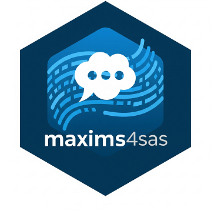

# maxims4sas

## Maxims of Maximally Efficient SAS Programmers ##

Presenting 52 programming advises and best practices
originally created and compiled by **Kurt Bremser** 
under `communities.sas.com` article:
["Maxims of Maximally Efficient SAS Programmers"](https://communities.sas.com/t5/SAS-Communities-Library/Maxims-of-Maximally-Efficient-SAS-Programmers/ta-p/352068) 
started and maintained since 2017-04-24.

Published as a **SAS Global Forum 2019** article: 
[Maxims of Maximally Efficient SAS Programmers](https://support.sas.com/resources/papers/proceedings19/3062-2019.pdf)

This package displays maxims that have deeply impressed us 
and that we wish to promoter them to future generations.

---

## Description:

The `%sas_maxims()` macro is provided.
It presents 50+ practical and philosophical principles aimed at
improving SAS programming habits. It can be used in training materials,
documentation, or as motivational content.

[The `%sas_maxims()` macro documentation](./maxims4sas.md)

## Examples:

**Example 1. Print all maxims.**

~~~~~~~~~~~~~~~~~~~~~~~~~~~~~~~~~~~~~~~~~~~~~~~~~~~~sas
%sas_maxims()
~~~~~~~~~~~~~~~~~~~~~~~~~~~~~~~~~~~~~~~~~~~~~~~~~~~~

 

**Example 2. Print maxims 1 to 6 and maxims 42 and 52.**
~~~~~~~~~~~~~~~~~~~~~~~~~~~~~~~~~~~~~~~~~~~~~~~~~~~~sas
%sas_maxims(1:6, 42, 52)
~~~~~~~~~~~~~~~~~~~~~~~~~~~~~~~~~~~~~~~~~~~~~~~~~~~~

---

## Notes on versions history

- 0.2.2(13August2025): Documentation polished.
- 0.2.0(07August2025): Possible to select Maxims. The visual beauty of the displayed text has also been greatly improved.
- 0.1.0(06August2025): Initial version.

---

## What is SAS Packages?

The package is built on top of **SAS Packages Framework(SPF)** developed by Bartosz Jablonski.

For more information about the framework, see [SAS Packages Framework](https://github.com/yabwon/SAS_PACKAGES).

You can also find more SAS Packages (SASPacs) in the [SAS Packages Archive(SASPAC)](https://github.com/SASPAC).

## How to use SAS Packages? (quick start)

### 1. Set-up SAS Packages Framework

First, create a directory for your packages and assign a `packages` fileref to it.

~~~~~~~~~~~~~~~~~~~~~~~~~~~~~~~~~~~~~~~~~~~~~~~~~~~~~~~~~~~~~~~~~~~~~~~~~~~~~~~~~~~~~~~~~~sas
filename packages "\path\to\your\packages";
~~~~~~~~~~~~~~~~~~~~~~~~~~~~~~~~~~~~~~~~~~~~~~~~~~~~~~~~~~~~~~~~~~~~~~~~~~~~~~~~~~~~~~~~~~

Secondly, enable the SAS Packages Framework.
(If you don't have SAS Packages Framework installed, follow the instruction in 
[SPF documentation](https://github.com/yabwon/SAS_PACKAGES/tree/main/SPF/Documentation) 
to install SAS Packages Framework.)

~~~~~~~~~~~~~~~~~~~~~~~~~~~~~~~~~~~~~~~~~~~~~~~~~~~~~~~~~~~~~~~~~~~~~~~~~~~~~~~~~~~~~~~~~~sas
%include packages(SPFinit.sas)
~~~~~~~~~~~~~~~~~~~~~~~~~~~~~~~~~~~~~~~~~~~~~~~~~~~~~~~~~~~~~~~~~~~~~~~~~~~~~~~~~~~~~~~~~~

### 2. Install SAS package

Install SAS package you want to use with the SPF's `%installPackage()` macro.

- For packages located in **SAS Packages Archive(SASPAC)** run:
  ~~~~~~~~~~~~~~~~~~~~~~~~~~~~~~~~~~~~~~~~~~~~~~~~~~~~~~~~~~~~~~~~~~~~~~~~~~~~~~~~~~~~~~~~~~sas
  %installPackage(packageName)
  ~~~~~~~~~~~~~~~~~~~~~~~~~~~~~~~~~~~~~~~~~~~~~~~~~~~~~~~~~~~~~~~~~~~~~~~~~~~~~~~~~~~~~~~~~~

- For packages located in **PharmaForest** run:
  ~~~~~~~~~~~~~~~~~~~~~~~~~~~~~~~~~~~~~~~~~~~~~~~~~~~~~~~~~~~~~~~~~~~~~~~~~~~~~~~~~~~~~~~~~~sas
  %installPackage(packageName, mirror=PharmaForest)
  ~~~~~~~~~~~~~~~~~~~~~~~~~~~~~~~~~~~~~~~~~~~~~~~~~~~~~~~~~~~~~~~~~~~~~~~~~~~~~~~~~~~~~~~~~~

- For packages located at some network location run:
  ~~~~~~~~~~~~~~~~~~~~~~~~~~~~~~~~~~~~~~~~~~~~~~~~~~~~~~~~~~~~~~~~~~~~~~~~~~~~~~~~~~~~~~~~~~sas
  %installPackage(packageName, sourcePath=https://some/internet/location/for/packages)
  ~~~~~~~~~~~~~~~~~~~~~~~~~~~~~~~~~~~~~~~~~~~~~~~~~~~~~~~~~~~~~~~~~~~~~~~~~~~~~~~~~~~~~~~~~~
  (e.g. `%installPackage(ABC, sourcePath=https://github.com/SomeRepo/ABC/raw/main/)`)

### 3. Load SAS package

Load SAS package you want to use with the SPF's `%loadPackage()` macro.

~~~~~~~~~~~~~~~~~~~~~~~~~~~~~~~~~~~~~~~~~~~~~~~~~~~~~~~~~~~~~~~~~~~~~~~~~~~~~~~~~~~~~~~~~~sas
%loadPackage(packageName)
~~~~~~~~~~~~~~~~~~~~~~~~~~~~~~~~~~~~~~~~~~~~~~~~~~~~~~~~~~~~~~~~~~~~~~~~~~~~~~~~~~~~~~~~~~

### Enjoy!

---
